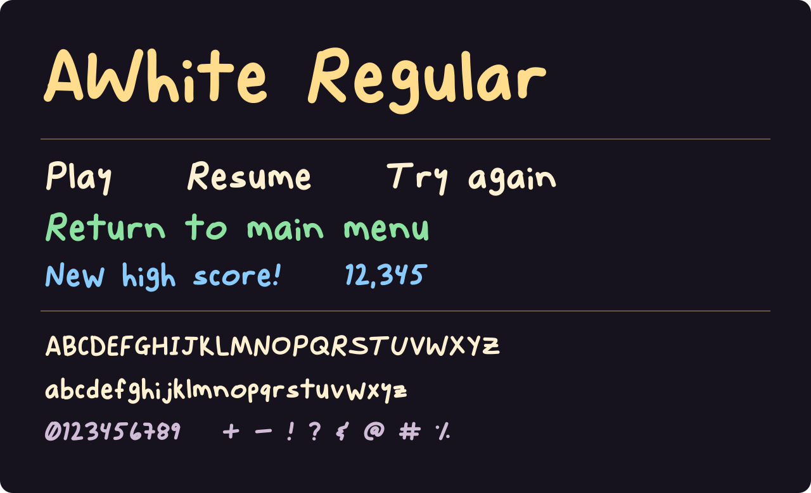

# AWhite Regular

Digitized from Andrew White’s own handwriting, circa 2024. Includes separate uppercase and lowercase forms. Available as OTF and WOFF2.



## Download

- **[AWhite-Regular.otf](fonts/otf/AWhite-Regular.otf)** — installable desktop and app font.
- **[AWhite-Regular.woff2](fonts/woff2/AWhite-Regular.woff2)** — compressed webfont.
- **[Latest release](https://github.com/andrew-dougie/awhite-regular/releases/latest)** — complete package with license, examples, and tools.

On macOS, open the desktop font in Font Book and select **Install**. On Windows, right-click it and select **Install**. The family appears as **AWhite** in font pickers.

## Font details

| Detail | Value |
| --- | --- |
| Family | AWhite |
| Style | Regular |
| PostScript name | `AWhite-Regular` |
| Weight | 400 |
| Mapped characters | 133 |
| Formats | OTF, WOFF2 |

Includes Latin letters, numerals, punctuation, and additional symbols. See the full [character map](fonts/characters.json). Unsupported characters require a fallback font. The original file does not map U+0020 (space); text systems supply fallback spacing. Uppercase and lowercase retain the forms in the supplied font.

The desktop file is preserved byte-for-byte from the font used in Best Friends. The WOFF2 is generated from that file and retains its glyph outlines, spacing, names, and character map. Vector outlines are included; color and pixelation are supplied by the host application.

## Install with a coding assistant

Copy this prompt into your coding assistant:

```text
Install AWhite Regular in this project using its existing framework and typography conventions.

Download and bundle the appropriate font from release v1.0.0:
- Native/desktop OTF: https://github.com/andrew-dougie/awhite-regular/releases/download/v1.0.0/AWhite-Regular.otf
- Web WOFF2: https://github.com/andrew-dougie/awhite-regular/releases/download/v1.0.0/AWhite-Regular.woff2
- License: https://raw.githubusercontent.com/andrew-dougie/awhite-regular/v1.0.0/OFL.txt

The family is "AWhite", normal style, weight 400. For iOS, add AWhite-Regular.otf to UIAppFonts and use the PostScript name AWhite-Regular. Include OFL.txt and preserve the 2024 Andrew White copyright attribution. This is Andrew White's own handwriting, digitized circa 2024.

Add a reusable font definition and a small preview. Keep a fallback font configured: the original font has 133 mapped characters and no explicit U+0020 space mapping. Verify the font loads from bundled assets, words have visible spacing, and uppercase/lowercase text renders. Explain the changed files and how to use the font.
```

## Web usage

```css
@font-face {
  font-family: "AWhite";
  src: url("AWhite-Regular.woff2") format("woff2");
  font-weight: 400;
  font-style: normal;
  font-display: swap;
}

.sample {
  font-family: "AWhite", sans-serif;
  font-weight: 400;
  font-style: normal;
  font-size: 2rem;
  line-height: 1.4;
}
```

An editable [browser specimen](examples/index.html) is included. Open it locally after downloading, or run `python3 -m http.server` from the repository and open `/examples/`.

## iOS usage

Add `AWhite-Regular.otf` to the target’s resources and list it under `UIAppFonts` in Info.plist:

```swift
label.font = UIFont(name: "AWhite-Regular", size: 28)
label.text = "Return to main menu"
```

## Packaging and verification

```sh
python3 -m venv .venv
source .venv/bin/activate
pip install -r requirements.txt
python tools/package-font.py
python tools/render-specimen.py
python tools/verify-font.py
```

The included desktop font supplies the outlines. The tools export WOFF2, generate the README specimen, and verify both formats. An editable font-design project or outline generator is not included.

## Attribution and license

Copyright © 2024 Andrew White. Licensed under the **[SIL Open Font License 1.1](OFL.txt)**. Retain the included copyright and license when redistributing the font. No Reserved Font Names are declared in the included license.
